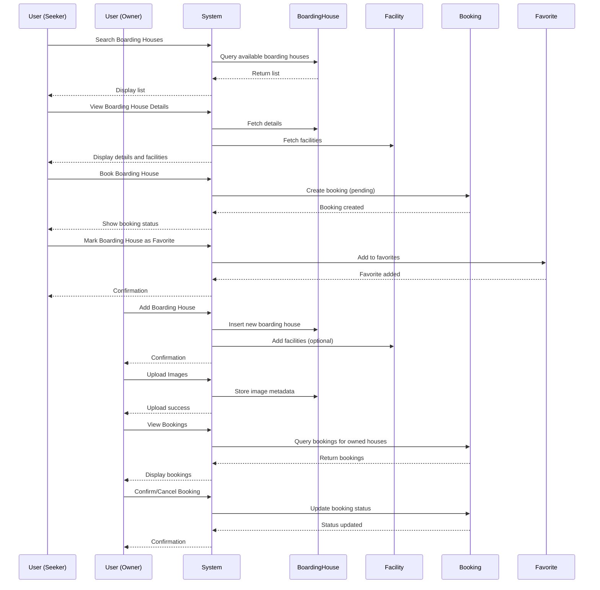

```mermaid
sequenceDiagram
    participant Seeker as User (Seeker)
    participant Owner as User (Owner)
    participant System
    participant BoardingHouse
    participant Facility
    participant Booking
    participant Favorite

    %% Seeker browsing boarding houses
    Seeker->>System: Search Boarding Houses
    System->>BoardingHouse: Query available boarding houses
    BoardingHouse-->>System: Return list
    System-->>Seeker: Display list

    %% Seeker views details
    Seeker->>System: View Boarding House Details
    System->>BoardingHouse: Fetch details
    System->>Facility: Fetch facilities
    System-->>Seeker: Display details and facilities

    %% Seeker books a boarding house
    Seeker->>System: Book Boarding House
    System->>Booking: Create booking (pending)
    Booking-->>System: Booking created
    System-->>Seeker: Show booking status

    %% Seeker marks as favorite
    Seeker->>System: Mark Boarding House as Favorite
    System->>Favorite: Add to favorites
    Favorite-->>System: Favorite added
    System-->>Seeker: Confirmation

    %% Owner adds a boarding house
    Owner->>System: Add Boarding House
    System->>BoardingHouse: Insert new boarding house
    System->>Facility: Add facilities (optional)
    System-->>Owner: Confirmation

    %% Owner uploads images
    Owner->>System: Upload Images
    System->>BoardingHouse: Store image metadata
    System-->>Owner: Upload success

    %% Owner views bookings
    Owner->>System: View Bookings
    System->>Booking: Query bookings for owned houses
    Booking-->>System: Return bookings
    System-->>Owner: Display bookings

    %% Owner confirms/cancels booking
    Owner->>System: Confirm/Cancel Booking
    System->>Booking: Update booking status
    Booking-->>System: Status updated
    System-->>Owner: Confirmation
```